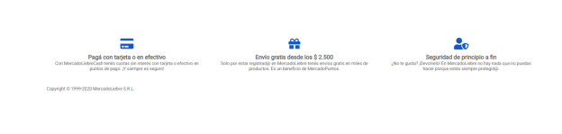

# Trabajo Practico Numero 6 - Mercado Liebre - Organizando y Animando Elementos.

## Desafio 1: 
## Para cada uno de los artículos:
- Nos piden que la descripción del producto esté oculta, a menos que los usuarios le pasen el mouse por arriba.
- Además, nos piden que cuando los usuarios le pasen el mouse por arriba, se visualice la sombra de la tarjeta de producto.
- Otro efecto (*) que nos piden es el que podemos ver en las siguientes imágenes, donde el ícono del camión de envío gira 90° hacia arriba suavemente cuando pasamos el mouse por encima.

## Desafio 2: 
### En nuestro login.html debemos lograr que cuando el mouse esté por encima del botón de envío del formulario, su color de fondo cambie a #0022AA.

## Desafio 3: 
### Repasando todo lo aprendido en Flexbox, debemos modificar el footer para que se visualice de la siguiente forma en dispositivos desktop. Además, cada vez que se pase el mouse por los íconos, estos deben cambiar de color (seleccionar el color que creas que mejor combina con la paleta de colores del sitio).

***********************************************************************************************************

